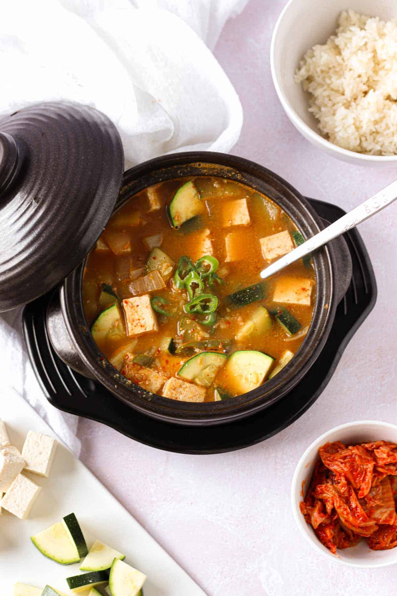
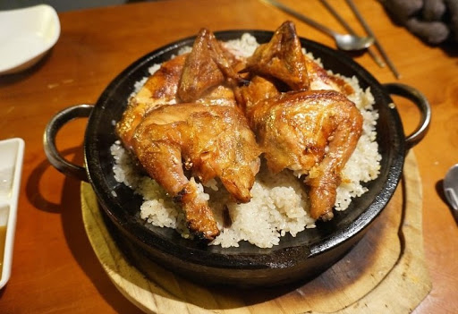

# Welcome! 🇰🇷🍲

Welcome to my colorful Korean food website created by **@steve0810kr**!

Korean food is famous for its **bold flavors**, **fermented ingredients**, and **colorful dishes**.

This website will introduce:

- 🌶 Basic information about Korean food culture  
- 🍚 Where some dishes come from  
- 🍲 Simple home-friendly recipes you can try  

---

## Popular Korean Dishes

### Kimchi (김치)

{width=40%}

Kimchi is a traditional fermented side dish made with cabbage, radish, chili pepper, garlic, and fish sauce.
It is served with almost every meal and is considered the heart of Korean cuisine.

---

### Bibimbap (비빔밥)

{width=40%}

Bibimbap literally means “mixed rice.”  
It usually includes rice, seasoned vegetables, gochujang (chili paste), sesame oil, and sometimes beef and fried egg.

---

### Tteokbokki (떡볶이)

{width=40%}

Tteokbokki is a chewy rice cake dish cooked in a spicy-sweet red sauce made with gochujang.
It’s a popular street food, especially with fish cakes and boiled eggs.

---

# ⭐ Favorite K-Food

## 🥘 Dolsot Bibimbap (돌솥비빔밥)
[{width=40%}](recipes.html#dolsot-bibimbap)

---

## 🍲 Doenjang Jjigae (된장찌개)
[{width=40%}](recipes.html#doenjang-jjigae)

---

## 🍗 Nurungji Chicken (누룽지 백숙)
[{width=40%}](recipes.html#nurungji-chicken)
