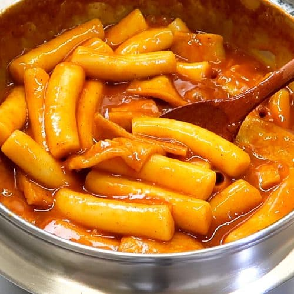

# Korean Recipes 🍜

Here are a few simple recipes inspired by Korean home cooking.  
(Adjust the spice level to your taste!)

---

<section class="recipe-block">

## 1. Bibimbap (비빔밥)

{width=40%}

### Ingredients (1–2 servings)

- 1 bowl cooked rice  
- 1 small carrot, julienned  
- A handful of spinach  
- Bean sprouts  
- Sliced mushrooms  
- Optional: ground beef or sliced beef  
- 1 egg  
- 1–2 tbsp **gochujang**  
- 1 tsp **sesame oil**  
- Sesame seeds, salt, garlic

### Steps

1. Prepare vegetables: quickly stir-fry or blanch spinach, carrot, bean sprouts, and mushrooms with a little oil, garlic, and salt.
2. Cook the beef (if using) with soy sauce, garlic, and pepper.
3. Fry an egg sunny-side up.
4. Place rice in a bowl and arrange the vegetables and meat on top in sections.
5. Add the fried egg in the center.
6. Add gochujang and sesame oil, sprinkle sesame seeds.
7. Mix everything well before eating.

</section>

---

<section class="recipe-block">

## 2. Kimchi Jjigae (김치찌개 – Kimchi Stew)

{width=20%}

### Ingredients

- 1 cup well-fermented kimchi  
- 100–150 g pork belly or tofu  
- 2 cups water or anchovy broth  
- 1 tbsp gochujang  
- 1 tbsp gochugaru (red pepper flakes) – optional  
- 1 tsp minced garlic  
- 1 tbsp soy sauce  
- Green onion

### Steps

1. In a pot, stir-fry kimchi and pork (or tofu) with a little oil and garlic.
2. Add gochujang and mix well.
3. Add water/broth and bring to a boil.
4. Season with soy sauce and gochugaru (if you want it spicier).
5. Simmer for 15–20 minutes.
6. Add chopped green onion at the end and serve with rice.

</section>

---

<section class="recipe-block">

## 3. Tteokbokki (떡볶이 – Spicy Rice Cakes)

{width=20%}

### Ingredients

- 200 g tteok (Korean rice cakes)  
- 2 cups water  
- 1–2 tbsp gochujang  
- 1 tbsp sugar  
- 1 tbsp soy sauce  
- Fish cakes (optional)  
- Green onion  
- Boiled egg (optional)

### Steps

1. In a pan, mix water, gochujang, sugar, and soy sauce. Bring to a boil.
2. Add rice cakes and cook until soft and sauce becomes thick.
3. Add fish cakes and green onion, cook a few more minutes.
4. Serve hot with a boiled egg on top if you like.

</section>

---

Tip  
You can reduce gochujang or add a little sugar if you don’t like very spicy food.

<footer>
Happy cooking! – @steve0810kr
</footer>
